<div align="center">

<picture>
  <source media="(prefers-color-scheme: dark) and (max-width: 640px)" srcset="assets/hero-mobile-dark.svg">
  <source media="(prefers-color-scheme: light) and (max-width: 640px)" srcset="assets/hero-mobile-light.svg">
  <source media="(prefers-color-scheme: dark)" srcset="assets/hero-dark.svg">
  <source media="(prefers-color-scheme: light)" srcset="assets/hero-light.svg">
  
</picture>

</div>

I build AI for healthcare software: assistants, RAG and evaluation systems on top of clinical workflows and EHR portals. At **HealthVision**, a behavioral health EHR, that means software where identity, scope and escalation are explicit, because clinicians and patients have to be able to trust it.

<sub>HYDERABAD, INDIA &nbsp;·&nbsp; AI × HEALTHCARE × SOFTWARE &nbsp;·&nbsp; AI & ML, OSMANIA UNIVERSITY 2026</sub>

<p>
  <a href="https://hismuq.vercel.app"><b>Portfolio</b></a> &nbsp;·&nbsp;
  <a href="https://linkedin.com/in/hismuq"><b>LinkedIn</b></a> &nbsp;·&nbsp;
  <a href="mailto:hismuq@gmail.com"><b>Email</b></a> &nbsp;·&nbsp;
  <a href="https://github.com/hismuq?tab=repositories"><b>Repositories</b></a>
</p>

```text
NOW ────────────────────────────────
healthcare AI · agentic systems
RAG · evaluation · reliable AI

STATUS (conceptual) ────────────────
●  AI systems     active
●  healthcare     building
○  research       exploring
●  hismuq         online
```

---

<sub>HISMUQ / NOW</sub>

### Currently building

| | |
|:--|:--|
| <sub>01 · PRACTICE</sub><br>**[hismuq](https://hismuq.vercel.app)** | The through-line: my engineering and research practice in clinical AI. The portfolio is where the case studies live. |
| <sub>02 · SYSTEM</sub><br>**Sparkle AI** | A patient-facing assistant in HealthVision's portal. It books and navigates, and knows when to stop, redirect or escalate. |
| <sub>03 · SYSTEM</sub><br>**HealthVision** | A behavioral health EHR with four portals (Provider, Care Team, Front Desk, Patient) over one clinical record. |

---

<sub>HISMUQ / SYSTEMS</sub>

### What I build

<div align="center">

<picture>
  <source media="(prefers-color-scheme: dark)" srcset="assets/system-flow-dark.svg">
  <source media="(prefers-color-scheme: light)" srcset="assets/system-flow-light.svg">
  
</picture>

</div>

<sub>A request reaches an agent. Retrieval, tools and guardrails shape what it can do, the healthcare workflow decides what happens next, and the outcome is bounded: an answer or an escalation. A conceptual diagram, not any deployed architecture.</sub>

| | | |
|:--|:--|:--|
| **01** | **Intelligent systems** | Agents · RAG · LLM applications · evaluation |
| **02** | **Healthcare software** | EHR portals · clinical workflows · patient-facing systems |
| **03** | **Reliability** | Guardrails · authorization boundaries · regression testing |
| **04** | **Research** | Machine learning · generative models · human-centered healthcare AI |

---

<sub>HISMUQ / WORK</sub>

### Selected work

<p>
<b>01 &nbsp; Sparkle AI</b> &nbsp;<sub>CLINICAL AI · PROPRIETARY</sub><br>
A patient-facing booking assistant. Authorization is bound to the signed-in patient, booking state survives interruptions, and scope and distress paths route to a safe outcome.<br>
<sub>React · TypeScript · ASP.NET Core · Vitest &nbsp;→&nbsp; <a href="https://hismuq.vercel.app">portfolio</a></sub>
</p>

<p>
<b>02 &nbsp; HealthVision</b> &nbsp;<sub>HEALTHCARE SOFTWARE · PROPRIETARY</sub><br>
Role-aware engineering across four portals, checked against role-specific data, viewports and accessibility audits.<br>
<sub>React · TypeScript · ASP.NET Core · Azure DevOps &nbsp;→&nbsp; <a href="https://hismuq.vercel.app">portfolio</a></sub>
</p>

<p>
<b>03 &nbsp; MedGAN</b> &nbsp;<sub>RESEARCH · OPEN</sub><br>
Generative models for synthetic medical images, to improve diagnostic robustness when real data is limited, imbalanced or privacy-restricted.<br>
<sub>Python · PyTorch · SAM &nbsp;→&nbsp; <a href="https://github.com/hismuq/B.E-Major-Project">repository</a></sub>
</p>

<p>
<b>04 &nbsp; FlyRank ML</b> &nbsp;<sub>APPLIED ML · OPEN</sub><br>
Search-ranking models on anonymized data: task framing, feature-leakage checks, baselines and validation audits.<br>
<sub>Python · DuckDB · Colab &nbsp;→&nbsp; <a href="https://github.com/hismuq/flyrank-ml-internship">repository</a></sub>
</p>

<p>
<b>05 &nbsp; hismuq</b> &nbsp;<sub>DESIGN ENGINEERING</sub><br>
An engineering portfolio built for keyboard use, reduced motion and speed.<br>
<sub>Next.js · TypeScript &nbsp;→&nbsp; <a href="https://hismuq.vercel.app">visit</a></sub>
</p>

<sub>Sparkle AI and HealthVision are proprietary, so their links go to written case studies, not code.</sub>

---

<sub>HISMUQ / PRINCIPLES</sub>

### How I build

<p>
<b>01 &nbsp; Start from the workflow</b><br>
<sub>Intelligence earns its place by fixing a real task for a real person, not by showing off a model.</sub>
</p>

<p>
<b>02 &nbsp; Know the boundary</b><br>
<sub>A system should know what it must not answer, and who takes over when it stops.</sub>
</p>

<p>
<b>03 &nbsp; Show the evidence</b><br>
<sub>Trust in healthcare software comes from tests, traces and human review, not from assertion.</sub>
</p>

---

<sub>HISMUQ / STACK</sub>

### Engineering stack

| | |
|:--|:--|
| **Languages** | Python · TypeScript · C# · SQL |
| **AI / ML** | PyTorch · TensorFlow · scikit-learn · LLM APIs · RAG · Azure AI |
| **Backend** | ASP.NET Core · REST APIs |
| **Frontend** | React · TypeScript · Vitest |
| **Platform** | Azure · Azure DevOps · Git · Vercel |
| **Data** | DuckDB · Pandas · NumPy · Jupyter |

---

<sub>HISMUQ / RESEARCH</sub>

### Research and interests

- **Healthcare AI:** assistants that stay inside their scope in clinical settings
- **AI safety and guardrails:** authorization, distress handling, escalation
- **RAG and LLM systems:** grounding and evaluation
- **EHR systems:** clinical records that stay coherent across roles
- **Synthetic data:** privacy-preserving medical imaging

---

<sub>Most of my recent work is in private, employer-owned repositories, so the public record is the [repositories](https://github.com/hismuq?tab=repositories) above and the case studies on my [portfolio](https://hismuq.vercel.app).</sub>

---

<div align="center">

**Software clinicians trust cannot be almost right.**

<sub><a href="mailto:hismuq@gmail.com">hismuq@gmail.com</a> &nbsp;·&nbsp; <a href="https://hismuq.vercel.app">hismuq.vercel.app</a></sub>

</div>

```text
$ whoami
hismuq
$ focus
healthcare × AI × systems
$ status
building
```
