<picture>
  <source media="(prefers-color-scheme: dark)" srcset="assets/hero-dark.svg">
  <source media="(prefers-color-scheme: light)" srcset="assets/hero-light.svg">
  
</picture>

I build AI for healthcare software: assistants, RAG and evaluation systems on top of clinical workflows and EHR portals. At **HealthVision**, a behavioral health EHR, that means software where identity, scope and escalation are explicit, because clinicians and patients have to be able to trust it.

Syed Muqeet Ahmed · AI & ML, Osmania University (2026) · Hyderabad

  <a href="https://hismuq.vercel.app"><b>Portfolio</b></a> &nbsp;·&nbsp;
  <a href="https://linkedin.com/in/hismuq"><b>LinkedIn</b></a> &nbsp;·&nbsp;
  <a href="mailto:hismuq@gmail.com"><b>Email</b></a> &nbsp;·&nbsp;
  <a href="https://github.com/hismuq?tab=repositories"><b>Repositories</b></a>

---

### Currently building

hismuq is the through-line: my engineering and research practice in clinical AI. Sparkle AI and HealthVision are the production systems where it is applied.

<table>
  <tr>
    <td width="34%" valign="top">
      01 · PRACTICE 
      <b><a href="https://hismuq.vercel.app">hismuq</a></b>  
      Clinical AI boundaries, healthcare software and the human judgment around both. The portfolio is where the case studies live.
    </td>
    <td width="33%" valign="top">
      02 · SYSTEM 
      <b>Sparkle AI</b>  
      A patient-facing assistant in HealthVision's portal. It books and navigates, and knows when to stop, redirect or escalate.
    </td>
    <td width="33%" valign="top">
      03 · SYSTEM 
      <b>HealthVision</b>  
      A behavioral health EHR with four portals (Provider, Care Team, Front Desk, Patient) over one clinical record.
    </td>
  </tr>
</table>

---

### What I build

| | | |
|:--|:--|:--|
| **01** | **Intelligent systems** | Agents · RAG · LLM applications · evaluation |
| **02** | **Healthcare software** | EHR portals · clinical workflows · patient-facing systems |
| **03** | **Reliability** | Guardrails · authorization boundaries · regression testing |
| **04** | **Research** | Machine learning · generative models · human-centered healthcare AI |

---

### Selected work

| Project | What it is |
|:--|:--|
| **Sparkle AI** Clinical AI · proprietary | A patient-facing booking assistant. Authorization is bound to the signed-in patient, booking state survives interruptions, and scope and distress paths route to a safe outcome. React · TypeScript · ASP.NET Core · Vitest · [case study](https://hismuq.vercel.app) |
| **HealthVision** Production EHR · proprietary | Role-aware engineering across four portals, checked against role-specific data, viewports and accessibility audits. React · TypeScript · ASP.NET Core · Azure DevOps · [case study](https://hismuq.vercel.app) |
| **MedGAN** Research · open | Generative models for synthetic medical images, to improve diagnostic robustness when real data is limited, imbalanced or privacy-restricted. Python · PyTorch · SAM · [repository](https://github.com/hismuq/B.E-Major-Project) |
| **FlyRank ML** Applied ML · open | Search-ranking models on anonymized data: task framing, feature-leakage checks, baselines and validation audits. Python · DuckDB · Colab · [repository](https://github.com/hismuq/flyrank-ml-internship) |
| **hismuq** Design engineering | An engineering portfolio built for keyboard use, reduced motion and speed. Next.js · TypeScript · [visit](https://hismuq.vercel.app) |

Sparkle AI and HealthVision are proprietary, so their links go to written case studies, not code.

---

### Engineering stack

| | |
|:--|:--|
| **Languages** | Python · TypeScript · C# · SQL |
| **AI / ML** | PyTorch · TensorFlow · scikit-learn · LLM APIs · RAG · Azure AI |
| **Backend** | ASP.NET Core · REST APIs |
| **Frontend** | React · TypeScript · Vitest |
| **Platform** | Azure · Azure DevOps · Git · Vercel |
| **Data** | DuckDB · Pandas · NumPy · Jupyter |

---

### Research and interests

- **Healthcare AI:** assistants that stay inside their scope in clinical settings
- **AI safety and guardrails:** authorization, distress handling, escalation
- **RAG and LLM systems:** grounding and evaluation
- **EHR systems:** clinical records that stay coherent across roles
- **Synthetic data:** privacy-preserving medical imaging

---

Most of my recent work is in private, employer-owned repositories, so the public record is the [repositories](https://github.com/hismuq?tab=repositories) above and the case studies on my [portfolio](https://hismuq.vercel.app).

---

**Software clinicians trust cannot be almost right.**

<a href="mailto:hismuq@gmail.com">hismuq@gmail.com</a> &nbsp;·&nbsp; <a href="https://hismuq.vercel.app">hismuq.vercel.app</a>

