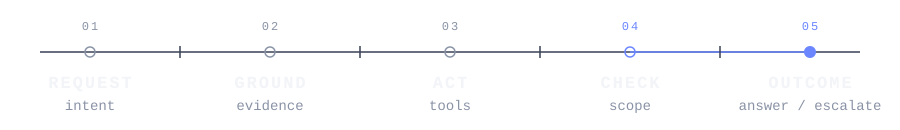

<picture>
  <source media="(prefers-color-scheme: dark) and (max-width: 640px)" srcset="assets/hero-mobile-dark.svg">
  <source media="(prefers-color-scheme: light) and (max-width: 640px)" srcset="assets/hero-mobile-light.svg">
  <source media="(prefers-color-scheme: dark)" srcset="assets/hero-dark.svg">
  <source media="(prefers-color-scheme: light)" srcset="assets/hero-light.svg">
  
</picture>

**I build AI systems for healthcare workflows where retrieval, tools, authorization, evaluation and escalation matter as much as the model itself.**

I work on production healthcare software and EHR workflows, and on assistants that have to stay inside an authorized scope. Alongside that I run small research experiments on how clinical assistants should stop, refuse and hand off.

## Building

### Healthcare AI
Production healthcare software and AI-assisted workflows across EHR experiences.

### Agent systems
Assistants that combine retrieval, tools, authorization boundaries and bounded outcomes.

### Reliability
Evaluation, guardrails, failure handling and escalation for systems that need clear boundaries.

<picture>
  <source media="(prefers-color-scheme: dark) and (max-width: 640px)" srcset="assets/runtime-trace-mobile-dark.svg">
  <source media="(prefers-color-scheme: light) and (max-width: 640px)" srcset="assets/runtime-trace-mobile-light.svg">
  <source media="(prefers-color-scheme: dark)" srcset="assets/runtime-trace-dark.svg">
  <source media="(prefers-color-scheme: light)" srcset="assets/runtime-trace-light.svg">
  
</picture>

## Selected work

**01 · Sparkle AI** 
Patient-facing assistant · behavioral-health EHR · *proprietary* 
Bounded booking and care-navigation workflows, with authorization bound to the signed-in patient and explicit stop and escalation paths. [Sparkle AI case study →](https://hismuq.vercel.app/work/sparkle-ai)

**02 · HealthVision** 
Behavioral-health EHR · four role-based portals · *proprietary* 
Production engineering where the screen, the saved record and downstream state have to agree, checked across roles, viewports and accessibility audits. [HealthVision case study →](https://hismuq.vercel.app/work/healthvision)

**03 · Refusal Without Abandonment** 
Research instrument · *public, preliminary* 
A deterministic benchmark of how an assistant's refusal and escalation contracts keep scope, context and next action visible. 12 synthetic scenarios; tests the interface contract, not a model. [Benchmark →](https://hismuq.vercel.app/lab/refusal-benchmark) · [Methods →](https://hismuq.vercel.app/lab/refusal-benchmark/methods)

Some production healthcare systems I work on are proprietary, so this profile focuses on engineering patterns rather than internal implementation details.

## Approach

**Scope before generation.** Know what the system must not answer, and who takes over when it stops.

**Evidence before confidence.** Trust in healthcare software comes from tests, traces and human review, not from assertion.

**Failure gets a bounded outcome.** Every stop has a designed path: a refusal, a redirect or an escalation, never a catch-all answer.

## Research direction

I'm interested in making healthcare AI systems more reliable under real workflow constraints. These are open research questions, not published results, and none implies clinical validation.

**01**  How do we evaluate whether a clinical assistant stays inside its authorized scope?

**02**  How should retrieval, tools and guardrails interact when an agent encounters uncertainty or conflicting evidence?

**03**  How can healthcare AI systems fail safely instead of merely producing more confident answers?

Working notes: [research brief](https://hismuq.vercel.app/research).

## Stack

| | |
|:--|:--|
| **Languages** | Python · TypeScript · C# |
| **ML and data** | PyTorch · scikit-learn · pandas · DuckDB |
| **Product and platform** | React · Next.js · ASP.NET Core · Vitest · Azure DevOps |
| **Domain** | EHR · patient workflows · clinical AI safety |

ML tooling is from my public repositories: [MedGAN](https://github.com/hismuq/B.E-Major-Project) (synthetic medical imaging, university project) and [FlyRank ML](https://github.com/hismuq/flyrank-ml-internship) (internship coursework on anonymized search data).

---

[Portfolio](https://hismuq.vercel.app) · [LinkedIn](https://linkedin.com/in/hismuq) · [Email](mailto:hismuq@gmail.com)

**Answer when you can. Escalate when you can't.**

